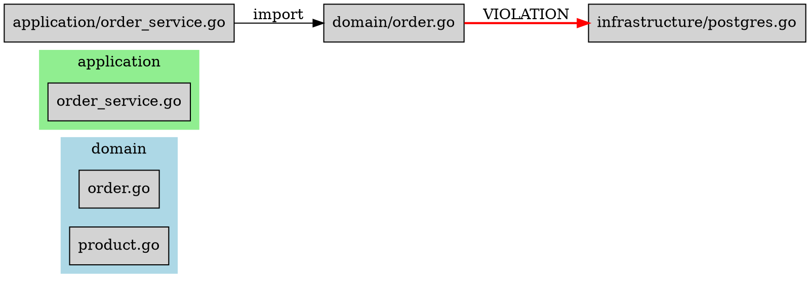

# Arx Dependency Diagrams

Visualize your architecture with dependency graphs in ASCII or Graphviz DOT format.

## Quick Start

```bash
# ASCII diagram in terminal
arx diagram

# Graphviz DOT format
arx diagram --format dot

# Export to file
arx diagram -o dependencies.dot

# Render with Graphviz
arx diagram -o deps.dot && dot -Tpng deps.dot -o deps.png
```

## Output Formats

### ASCII (Terminal)

Default format for quick terminal inspection:

```
┌──────────────────────────────────────────────────┐
│                     domain                       │
└──────────────────────────────────────────────────┘
│
▼ 5 import/ies
│
┌──────────────────────────────────────────────────┐
│                  application                     │
├──────────────────────────────────────────────────┤
│   → domain (5)                                   │
│ [!] → infrastructure (1)                         │
└──────────────────────────────────────────────────┘
│
▼ [VIOLATION] 1 dependency/ies
│
┌──────────────────────────────────────────────────┐
│                 infrastructure                   │
└──────────────────────────────────────────────────┘

═══════════════════════════════════════
 SUMMARY
═══════════════════════════════════════
Layers:        4
Dependencies:  15
Violations:    1

[!] = Violation
```

**Features:**
- ✅ Box-drawing characters for layer boundaries
- ✅ `[!]` markers for violations
- ✅ Dependency counts per layer
- ✅ Summary statistics

### Graphviz DOT

Professional diagrams for documentation:



**Features:**
- ✅ Layer subgraphs with distinct colors
- ✅ Red edges for violations
- ✅ Import labels on edges
- ✅ Compatible with Graphviz tools

## Rendering DOT Files

### PNG Export

```bash
dot -Tpng dependencies.dot -o dependencies.png
```

### SVG Export (Recommended for Documentation)

```bash
dot -Tsvg dependencies.dot -o dependencies.svg
```

### PDF Export

```bash
dot -Tpdf dependencies.dot -o dependencies.pdf
```

### Interactive HTML

```bash
# Install graphviz-interact if needed
npm install -g graphviz-interact
dot -Tsvg dependencies.dot -o dependencies.svg
# Open in browser for interactive exploration
```

## Advanced Usage

### Filter by Depth

```bash
# Show only direct dependencies from entry points
arx diagram --max-depth 1

# Show full dependency chain
arx diagram --max-depth 0  # default, unlimited
```

### Custom Config

```bash
# Use custom config file
arx diagram --config config/arch.yaml

# Analyze specific project path
arx diagram ./my-project
```

### Output to Multiple Formats

```bash
# Generate both ASCII and DOT
arx diagram > architecture.txt
arx diagram --format dot -o architecture.dot

# Convert DOT to PNG
dot -Tpng architecture.dot -o architecture.png
```

## Reading Diagrams

### Layer Subgraphs

Each layer is represented as a **subgraph** (box) containing its files:

```
subgraph cluster_domain {
  label="domain";
  color=lightblue;
  "order.go"
  "product.go"
}
```

**Colors by Layer:**
| Layer | Color |
|-------|-------|
| domain | lightblue |
| application | lightgreen |
| infrastructure | lightyellow |
| interface | lightpink |
| ports | lightcyan |
| adapters | lightcoral |
| other | lightgray |

### Dependency Edges

**Valid Dependencies:**
```
"application/service.go" -> "domain/entity.go" [label="import"];
```

**Violations (Red, Bold):**
```
"domain/entity.go" -> "infrastructure/db.go" [color=red, penwidth=2, label="VIOLATION"];
```

### Violation Markers

**ASCII:**
- `[!]` prefix indicates violation
- `[VIOLATION]` in arrow labels

**DOT:**
- `color=red` — red edge
- `penwidth=2` — thicker line
- `label="VIOLATION"` — explicit marker

## Use Cases

### 1. Architecture Review

```bash
# Generate diagram for architecture review meeting
arx diagram --format dot -o review.dot
dot -Tpdf review.dot -o review.pdf
# Present in meeting
```

### 2. Onboarding Documentation

```bash
# Add to project README
arx diagram --format dot -o docs/architecture.dot
dot -Tsvg docs/architecture.dot -o docs/architecture.svg
# Embed SVG in README
```

### 3. Violation Triage

```bash
# Quick terminal view to identify violations
arx diagram | grep -A 2 "\[!\]"

# Export for tracking
arx diagram --format dot > violations.dot
# Open in Graphviz viewer, focus on red edges
```

### 4. CI/CD Artifact

```yaml
# .github/workflows/architecture.yml
- name: Generate dependency diagram
  run: arx diagram --format dot -o architecture.dot

- name: Upload diagram artifact
  uses: actions/upload-artifact@v4
  with:
    name: architecture-diagram
    path: architecture.dot
```

### 5. Before/After Comparison

```bash
# Before refactoring
arx diagram --format dot -o before.dot

# ... do refactoring ...

# After refactoring
arx diagram --format dot -o after.dot

# Compare
diff -u before.dot after.dot
# Or generate images side-by-side
dot -Tpng before.dot -o before.png
dot -Tpng after.dot -o after.png
```

## Integration with Tools

### GitHub

```yaml
# .github/workflows/diagram.yml
name: Architecture Diagram

on:
  push:
    branches: [main]

jobs:
  diagram:
    runs-on: ubuntu-latest
    steps:
      - uses: actions/checkout@v4
      
      - name: Install Arx
        run: go install github.com/pauvalls/arx/cmd/arx@latest
      
      - name: Generate diagram
        run: arx diagram --format dot -o architecture.dot
      
      - name: Convert to PNG
        run: dot -Tpng architecture.dot -o architecture.png
      
      - name: Upload artifact
        uses: actions/upload-artifact@v4
        with:
          name: architecture-diagram
          path: architecture.png
```

### GitLab CI

```yaml
# .gitlab-ci.yml
architecture-diagram:
  image: golang:1.21
  script:
    - go install github.com/pauvalls/arx/cmd/arx@latest
    - arx diagram --format dot -o architecture.dot
    - dot -Tsvg architecture.dot -o architecture.svg
  artifacts:
    paths:
      - architecture.svg
    expire_in: 1 week
```

### Makefile

```makefile
.PHONY: diagram

diagram:
	arx diagram --format dot -o docs/architecture.dot
	dot -Tsvg docs/architecture.dot -o docs/architecture.svg
	@echo "✓ Diagram generated: docs/architecture.svg"

diagram-png:
	arx diagram --format dot -o docs/architecture.dot
	dot -Tpng docs/architecture.dot -o docs/architecture.png
	@echo "✓ Diagram generated: docs/architecture.png"
```

## Troubleshooting

### "No layers defined"

```
$ arx diagram
No layers defined in configuration
```

**Solution:** Run `arx init` first to generate `arx.yaml`:
```bash
arx init
arx diagram
```

### "Failed to load config"

```
$ arx diagram
Error: failed to load config: file not found: arx.yaml
```

**Solution:** Ensure `arx.yaml` exists in current directory or specify path:
```bash
arx diagram --config path/to/arx.yaml
```

### Graphviz Not Installed

```
$ dot -Tpng deps.dot -o deps.png
bash: dot: command not found
```

**Solution:** Install Graphviz:
```bash
# macOS
brew install graphviz

# Ubuntu/Debian
apt-get install graphviz

# Windows
choco install graphviz
```

### Large Diagrams (Many Files)

If the diagram is too large:

1. **Filter by layer:**
   ```bash
   # Edit arx.yaml to focus on specific layers
   ```

2. **Use max-depth:**
   ```bash
   arx diagram --max-depth 2
   ```

3. **Export to interactive format:**
   ```bash
   arx diagram --format dot -o deps.dot
   # Open in Graphviz viewer with zoom/pan
   ```

## Best Practices

### 1. Regular Generation

Generate diagrams regularly to track architectural drift:
```bash
# Weekly in CI
arx diagram --format dot -o docs/architecture-week-$(date +%W).dot
```

### 2. Version Control

Commit DOT files (not PNG/SVG) to version control:
```bash
git add docs/architecture.dot
# DOT is text, diff-friendly
# Generate images on-demand
```

### 3. Documentation

Embed diagrams in architecture documentation:
```markdown
## Architecture Overview


Generated with: `arx diagram --format dot -o architecture.dot`
```

### 4. Violation Focus

Use diagrams to prioritize violation fixes:
1. Generate diagram
2. Identify red edges (violations)
3. Fix highest-impact violations first
4. Re-generate to verify improvement

## Examples

### Example 1: Clean Architecture

```bash
arx init --preset clean
arx diagram
```

**Expected Output:**
- Domain layer isolated (no outgoing edges)
- Application depends on domain
- Infrastructure implements interfaces
- Interface adapters on outer layer

### Example 2: Detecting Circular Dependencies

```bash
arx diagram --format dot | grep -i "VIOLATION"
```

**Look for:**
- Red edges pointing "backward" in dependency flow
- Multiple violations between same layers

### Example 3: Layer Coupling Analysis

```bash
# Count dependencies per layer pair
arx diagram --format dot | grep -o '"[^"]*" -> "[^"]*"' | sort | uniq -c | sort -rn
```

**Output:**
```
  15 "application" -> "domain"
   8 "infrastructure" -> "domain"
   3 "interface" -> "application"
   1 "domain" -> "infrastructure" [VIOLATION]
```

## Resources

- [Graphviz Documentation](https://graphviz.org/documentation/)
- [DOT Language Guide](https://graphviz.org/doc/info/lang.html)
- [Graphviz Online Renderer](https://dreampuf.github.io/GraphvizOnline/)
