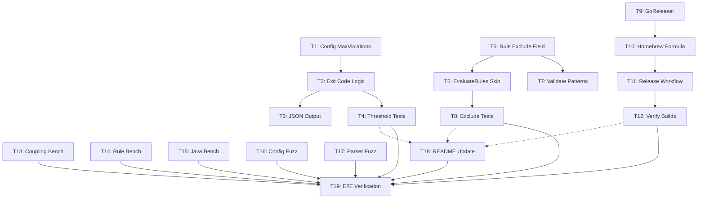

# Implementation Tasks: Arx v0.12.0 Release Automation + Config Quality

**Change ID:** `arx-v0.12.0-release-config-quality`  
**Status:** Ready for implementation  
**Estimated Effort:** 3-4 days  
**Critical Path:** Phase 1 → Phase 2 → Phase 3 → Phase 5

---

## Phase 1: Fail Threshold (Quick Win)

**Goal:** Add `max_violations` config option to allow CI tolerance for incremental adoption.

### T1: Add MaxViolations Field to Config Struct

**File:** `internal/domain/config.go`

**Changes:**
- Add `MaxViolations int` field to `Config` struct with YAML/JSON tags
- Add `ViolationThreshold() int` method to return the threshold value
- Update `Validate()` to ensure `MaxViolations >= 0`

**Acceptance Criteria:**
- [ ] Field defined with `yaml:"max_violations,omitempty"` and `json:"max_violations,omitempty"`
- [ ] Default value is 0 (unlimited, backward-compatible)
- [ ] Validation rejects negative values with clear error message
- [ ] Unit tests for validation edge cases (0, -1, positive values)

**Estimated Time:** 1 hour

---

### T2: Modify Check Exit Code to Respect Threshold

**Files:** `internal/infrastructure/output/terminal.go`, `cmd/arx/check.go`

**Changes:**
- Modify `ExitCode()` function to accept `maxViolations int` parameter
- Update logic: return 0 if non-overridden violations ≤ max_violations
- Update `check.go` to pass `config.MaxViolations` to `ExitCode()`

**Acceptance Criteria:**
- [ ] `ExitCode(violations, maxViolations)` signature updated
- [ ] Exit code 0 when violations ≤ threshold (and > 0)
- [ ] Exit code 1 when violations > threshold
- [ ] Exit code 0 when no violations (existing behavior)
- [ ] Integration test: run `arx check` with various violation counts

**Estimated Time:** 1.5 hours

---

### T3: JSON Output Includes max_violations Field

**File:** `internal/infrastructure/output/json.go`

**Changes:**
- Add `MaxViolations int` field to `JSONOutput` struct
- Update `Report()` to populate field from config

**Acceptance Criteria:**
- [ ] JSON output includes `"max_violations": <value>` in root object
- [ ] Field omitted when 0 (omitempty behavior)
- [ ] Integration test: verify JSON structure with threshold set

**Estimated Time:** 0.5 hours

---

### T4: Tests for Threshold

**Files:** `internal/infrastructure/output/terminal_test.go`, `test/integration/audit_test.go`

**Changes:**
- Unit tests for `ExitCode()` with threshold (table-driven)
- Integration test for end-to-end exit code behavior

**Test Cases:**
- [ ] 0 violations, threshold 0 → exit 0
- [ ] 0 violations, threshold 5 → exit 0
- [ ] 3 violations, threshold 5 → exit 0
- [ ] 5 violations, threshold 5 → exit 0
- [ ] 6 violations, threshold 5 → exit 1
- [ ] 3 violations (all overridden), threshold 0 → exit 0
- [ ] Integration: create test project, set threshold, verify exit codes

**Estimated Time:** 2 hours

---

## Phase 2: Per-Rule Exclude Paths (Quick Win)

**Goal:** Allow rules to exclude specific paths using glob patterns.

### T5: Add Exclude Field to Rule Struct + Glob Matching

**File:** `internal/domain/rule.go`

**Changes:**
- Add `Exclude []string` field to `Rule` struct
- Add `compiledExclude []*regexp.Regexp` for cached patterns
- Add `CompileExcludePatterns() error` method
- Add `IsExcludedFor(filePath string) bool` method using glob matching
- Reuse `MatchImportToLayer` logic from `shared/glob.go` or extract to domain

**Acceptance Criteria:**
- [ ] Field defined with `yaml:"exclude,omitempty"` and `json:"exclude,omitempty"`
- [ ] `CompileExcludePatterns()` converts glob patterns to regex
- [ ] `IsExcludedFor()` returns true if any exclude pattern matches
- [ ] Patterns support `*` (single segment) and `**` (multiple segments)
- [ ] Unit tests for glob matching (exact, prefix, wildcard)

**Estimated Time:** 2 hours

---

### T6: Modify EvaluateRules to Skip Excluded Paths

**File:** `internal/domain/audit.go`

**Changes:**
- Call `rule.IsExcludedFor(dep.SourceFile)` before creating violation
- Skip dependency if excluded

**Acceptance Criteria:**
- [ ] Excluded files do not generate violations for that rule
- [ ] Non-excluded files still evaluated normally
- [ ] Integration test: create rule with exclude, verify violations skipped

**Estimated Time:** 1 hour

---

### T7: Validate Exclude Patterns at Config Load

**File:** `internal/infrastructure/config/yaml.go`

**Changes:**
- After YAML unmarshal, call `CompileExcludePatterns()` on each rule
- Return error if any pattern fails to compile

**Acceptance Criteria:**
- [ ] Invalid glob patterns rejected at config load time
- [ ] Error message includes rule ID and problematic pattern
- [ ] Unit tests for invalid patterns (`[unclosed`, `***/invalid`, etc.)

**Estimated Time:** 1 hour

---

### T8: Tests for Excludes

**Files:** `internal/domain/rule_test.go`, `test/integration/rules_pattern_test.go`

**Changes:**
- Unit tests for `IsExcludedFor()` with various patterns
- Integration test for end-to-end exclude behavior

**Test Cases:**
- [ ] Exact match: `internal/legacy/foo.go` excluded by `internal/legacy/foo.go`
- [ ] Prefix match: `internal/legacy/bar.go` excluded by `internal/legacy/`
- [ ] Glob `*`: `internal/legacy/old.go` excluded by `internal/legacy/*.go`
- [ ] Glob `**`: `internal/legacy/deep/nested.go` excluded by `internal/legacy/**`
- [ ] No match: `internal/new/foo.go` NOT excluded by `internal/legacy/*`
- [ ] Integration: create test project with exclude rule, verify violations

**Estimated Time:** 2 hours

---

## Phase 3: Release Automation (Medium)

**Goal:** Enable production-ready distribution via GoReleaser and Homebrew.

### T9: Create .goreleaser.yaml

**File:** `.goreleaser.yaml` (root)

**Contents:**
- Build matrix: linux/amd64, linux/arm64, darwin/amd64, darwin/arm64, windows/amd64
- Archive format: tar.gz (unix), zip (windows)
- Checksums: sha256
- Homebrew tap configuration
- GitHub Releases integration
- Changelog generation

**Acceptance Criteria:**
- [ ] All target platforms build successfully
- [ ] Binary named `arx` with version embedded
- [ ] Homebrew formula template generated
- [ ] `goreleaser build --snapshot` succeeds locally
- [ ] Checksums file generated

**Estimated Time:** 2 hours

---

### T10: Create Homebrew Formula Template

**File:** `Formula/arx.rb` (or configure GoReleaser to auto-generate)

**Approach:**
- Use GoReleaser's `brews` section to auto-generate formula
- Configure tap repository: `pauvalls/homebrew-arx`
- Formula includes: binary installation, license, caveats

**Acceptance Criteria:**
- [ ] GoReleaser configured to push formula to homebrew tap
- [ ] Formula passes `brew audit --strict arx`
- [ ] Formula installs binary to correct location
- [ ] Version and SHA256 checksums auto-updated on release

**Estimated Time:** 1.5 hours

---

### T11: Create GitHub Release Workflow

**File:** `.github/workflows/release.yml`

**Contents:**
- Trigger: tags matching `v*.*.*`
- Jobs:
  - `build`: Run `goreleaser release`
  - Environment variables: `GITHUB_TOKEN`, `HOMEBREW_TAP_GITHUB_TOKEN`
- Permissions: contents write, packages write

**Acceptance Criteria:**
- [ ] Workflow triggers on version tags
- [ ] GoReleaser builds all platforms
- [ ] Release notes auto-generated from changelog
- [ ] Homebrew formula PR created in tap repo
- [ ] Workflow fails fast on build errors

**Estimated Time:** 1.5 hours

---

### T12: Verify Build Matrix Compiles

**Files:** N/A (verification task)

**Changes:**
- Run `goreleaser build --snapshot --rm-dist` locally
- Verify all platform binaries compile
- Test binary execution on at least one platform

**Acceptance Criteria:**
- [ ] All 5 platform builds succeed
- [ ] Binary runs `arx --version` successfully
- [ ] Binary runs `arx check --help` successfully
- [ ] No CGO dependencies (static linking)

**Estimated Time:** 1 hour

---

## Phase 4: Quality Infrastructure (Parallel)

**Goal:** Establish performance baselines and catch edge cases via fuzzing.

### T13: Coupling Matrix Benchmark

**File:** `internal/domain/coupling_bench_test.go`

**Changes:**
- `BenchmarkCouplingMatrix` with varying layer counts (2, 5, 10, 20 layers)
- Measure `CalculateCouplingMatrix()` performance

**Acceptance Criteria:**
- [ ] Benchmark runs with `go test -bench=. -benchmem`
- [ ] Reports ns/op, allocs/op, B/op
- [ ] Baseline recorded in benchmark results
- [ ] No memory leaks detected

**Estimated Time:** 1 hour

---

### T14: Rule Evaluation Benchmark

**File:** `internal/domain/audit_bench_test.go`

**Changes:**
- `BenchmarkRuleEvaluation` with varying rule/dependency counts
- Test cases: (10 rules × 100 deps), (50 rules × 500 deps), (100 rules × 1000 deps)

**Acceptance Criteria:**
- [ ] Benchmark scales linearly or better
- [ ] Performance baseline documented
- [ ] Identifies hot paths for optimization

**Estimated Time:** 1 hour

---

### T15: Java Parser Benchmark

**File:** `internal/infrastructure/detector/java/parser_bench_test.go`

**Changes:**
- `BenchmarkJavaExtraction` on sample Java files
- Measure `ExtractImports()` performance
- Use sample files from `test/fixtures/java/`

**Acceptance Criteria:**
- [ ] Benchmark runs on realistic Java files
- [ ] Reports parsing throughput (files/sec)
- [ ] Memory allocation per file measured

**Estimated Time:** 1 hour

---

### T16: Config YAML Fuzz Test

**File:** `internal/infrastructure/config/config_fuzz_test.go`

**Changes:**
- `FuzzConfigParse` with malformed YAML inputs
- Test: invalid syntax, unknown fields, type mismatches

**Acceptance Criteria:**
- [ ] Fuzz test runs with `go test -fuzz=FuzzConfigParse`
- [ ] No panics on malformed input
- [ ] Graceful error messages returned
- [ ] Fuzz corpus saved for regression

**Estimated Time:** 1.5 hours

---

### T17: Java/C# Parser Fuzz Tests

**Files:** 
- `internal/infrastructure/detector/java/parser_fuzz_test.go`
- `internal/infrastructure/detector/csharp/parser_fuzz_test.go`

**Changes:**
- `FuzzJavaParse` with malformed Java source
- `FuzzCSharpParse` with malformed C# source
- Test: syntax errors, encoding issues, edge cases

**Acceptance Criteria:**
- [ ] Fuzz tests run without panics
- [ ] Parser returns errors instead of crashing
- [ ] Fuzz corpora saved for regression testing

**Estimated Time:** 2 hours

---

## Phase 5: Polish

**Goal:** Documentation and end-to-end verification.

### T18: Update README with New Config Options

**File:** `README.md`

**Changes:**
- Document `max_violations` config option with examples
- Document `exclude` field on rules with glob pattern examples
- Add release/installation section (Homebrew, GitHub Releases)
- Update CI/CD example to show threshold usage

**Acceptance Criteria:**
- [ ] `max_violations` example: gradual adoption use case
- [ ] `exclude` example: legacy code exclusion
- [ ] Installation instructions include Homebrew command
- [ ] CI/CD example shows threshold in action

**Estimated Time:** 1.5 hours

---

### T19: End-to-End Verification

**Files:** `test/integration/` (existing + new)

**Changes:**
- Create test project with `max_violations` set
- Create test project with `exclude` patterns
- Verify GoReleaser build locally
- Run full test suite: `go test ./...`
- Verify all benchmarks run

**Acceptance Criteria:**
- [ ] All unit tests pass
- [ ] All integration tests pass
- [ ] `goreleaser build --snapshot` succeeds
- [ ] Manual verification: `arx check` with threshold works
- [ ] Manual verification: `arx check` with excludes works
- [ ] No regressions in existing functionality

**Estimated Time:** 2 hours

---

## Review Workload Forecast

| Phase | Tasks | Review Time | Complexity |
|-------|-------|-------------|------------|
| Phase 1 | T1-T4 | 2-3 hours | Low (straightforward logic) |
| Phase 2 | T5-T8 | 3-4 hours | Medium (glob matching edge cases) |
| Phase 3 | T9-T12 | 2-3 hours | Medium (CI/CD config review) |
| Phase 4 | T13-T17 | 2-3 hours | Low (benchmarks/fuzz tests are isolated) |
| Phase 5 | T18-T19 | 1-2 hours | Low (documentation + verification) |
| **Total** | **19 tasks** | **10-15 hours** | **Medium** |

**Review Focus Areas:**
1. **T2 (Exit Code Logic):** Ensure threshold logic doesn't break existing baseline behavior
2. **T5 (Glob Matching):** Verify pattern matching is secure (no ReDoS vulnerabilities)
3. **T7 (Config Validation):** Error messages must be actionable
4. **T9 (GoReleaser):** Security review of build permissions and token scopes

---

## Critical Path Analysis

```
Phase 1 (T1→T2→T3→T4) ──────┐
    │                        │
    ▼                        │
Phase 2 (T5→T6→T7→T8) ──────┼──→ Phase 5 (T18→T19)
    │                        │
    ▼                        │
Phase 3 (T9→T10→T11→T12) ───┘
    │
    ▼
Phase 4 (T13-T17) [PARALLEL]
```

**Critical Path:** Phase 1 → Phase 2 → Phase 3 → Phase 5

**Rationale:**
- Phase 1 and 2 are user-facing features that must work before release
- Phase 3 (release automation) blocks the actual v0.12.0 release
- Phase 4 (benchmarks/fuzz tests) can run in parallel — valuable but not blocking
- Phase 5 (polish) requires all features complete for accurate documentation

**Parallelization Opportunities:**
- Phase 4 tasks (T13-T17) are independent and can be done anytime
- T9 (GoReleaser config) can start after T1 is complete (no dependency on Phase 2)
- T18 (README) can be drafted while Phase 3-4 are in progress

**Risk Mitigation:**
- If Phase 2 (glob matching) encounters issues, ship Phase 1 + 3 first
- Fuzz tests (T16-T17) may find bugs — allocate buffer time for fixes
- Homebrew tap setup (T10) may require manual repo creation — do early

---

## Task Dependencies



**Legend:**
- `→` = Hard dependency (must complete first)
- `-.->` = Soft dependency (should complete before)

---

## Definition of Done (Per Task)

Each task is complete when:
- [ ] Code changes implemented
- [ ] Unit/integration tests pass
- [ ] No linting errors (`go lint ./...`)
- [ ] No breaking changes to existing API
- [ ] Peer review completed
- [ ] Merged to main branch

---

## Rollout Plan

1. **Week 1:** Phase 1 + Phase 2 (core features)
2. **Week 2:** Phase 3 + Phase 4 (release automation + quality)
3. **Week 3:** Phase 5 + release candidate testing
4. **Release:** Tag v0.12.0, trigger GoReleaser, publish Homebrew formula

**Backward Compatibility:** All changes are additive — existing configs continue to work without modification.
