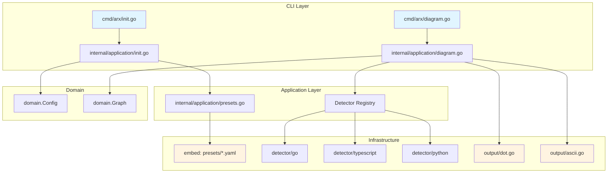

# Design: Arx v0.5.0 — Config Presets + Dependency Diagram

## Technical Approach

Implement two additive features following existing hexagonal architecture patterns:

1. **Config Presets**: Extend `init` command with `--preset` flag that loads embedded YAML templates, applies project-specific customization, and writes config
2. **Dependency Diagram**: New `diagram` command that reuses detector infrastructure to build dependency graph, exports to DOT format with ASCII terminal fallback

Both features are non-breaking and integrate with existing ports/interfaces.

## Architecture Decisions

### Decision: Preset Template Storage

**Choice**: Embed templates in Go binary using `//go:embed` in `internal/application/presets/`

**Alternatives considered**:
- Store in `configs/presets/` directory on filesystem
- Download templates from remote CDN

**Rationale**: 
- ✅ Embed ensures templates are always available, no file I/O errors
- ✅ Binary is self-contained, easier distribution
- ✅ Follows Go best practices for static assets
- ❌ Filesystem would require install step, prone to path issues
- ❌ Remote would add network dependency, latency

### Decision: Diagram Output Format

**Choice**: DOT format (Graphviz) with ASCII terminal fallback

**Alternatives considered**:
- SVG/PNG direct generation
- Mermaid format
- JSON graph structure

**Rationale**:
- ✅ DOT is universal, can be converted to SVG/PNG/SVG later
- ✅ Graphviz is mature, widely available
- ✅ ASCII fallback works in any terminal without dependencies
- ❌ Direct SVG/PNG would require CGO or external binaries
- ❌ Mermaid less flexible for complex graphs

### Decision: Diagram Service Architecture

**Choice**: Reuse existing detector infrastructure, add diagram-specific port

**Alternatives considered**:
- Create separate diagram detector
- Generate diagram during `check` command

**Rationale**:
- ✅ Reuses existing dependency extraction logic
- ✅ Single responsibility: diagram service focuses on graph building
- ❌ Separate detector would duplicate code
- ❌ Mixing with `check` would couple unrelated concerns

## Data Flow

```
Config Presets:
┌─────────────┐     ┌──────────────┐     ┌─────────────┐     ┌──────────────┐
│ cmd/arx/    │────▶│ internal/    │────▶│ embed:      │     │ arx.yaml     │
│ init.go     │     │ application/ │     │ presets/    │────▶│ (generated)  │
│ --preset    │     │ init.go      │     │ *.yaml      │     │              │
└─────────────┘     └──────────────┘     └─────────────┘     └──────────────┘

Dependency Diagram:
┌─────────────┐     ┌──────────────┐     ┌─────────────┐     ┌──────────────┐
│ cmd/arx/    │────▶│ internal/    │────▶│ detectors   │────▶│ DOT file     │
│ diagram.go  │     │ application/ │     │ (reuse)     │     │ or ASCII     │
│             │     │ diagram.go   │     │             │     │ terminal     │
└─────────────┘     └──────────────┘     └─────────────┘     └──────────────┘
```

## File Changes

| File | Action | Description |
|------|--------|-------------|
| `internal/application/presets/clean.yaml` | Create | Clean Architecture preset template |
| `internal/application/presets/hexagonal.yaml` | Create | Hexagonal/Ports-Adapters preset template |
| `internal/application/presets/ddd.yaml` | Create | DDD preset template |
| `internal/application/presets.go` | Create | Embed FS + preset loader service |
| `internal/application/init.go` | Modify | Add `LoadPreset()` function, modify `GenerateConfig()` to accept preset |
| `cmd/arx/init.go` | Modify | Add `--preset` flag, pass to service |
| `internal/application/diagram.go` | Create | Diagram service: build graph, export DOT |
| `internal/infrastructure/output/dot.go` | Create | DOT format exporter implementation |
| `internal/infrastructure/output/ascii.go` | Create | ASCII terminal renderer |
| `cmd/arx/diagram.go` | Create | CLI command handler for diagram |

## Interfaces / Structs Key

### Preset System

```go
// internal/application/presets.go

//go:embed presets/*.yaml
var presetFS embed.FS

// PresetTemplate represents a configuration template
type PresetTemplate struct {
    Name        string
    Description string
    Config      *domain.Config
}

// LoadPreset loads a preset template by name (clean, hexagonal, ddd)
func LoadPreset(name string) (*PresetTemplate, error)

// ApplyPreset creates a config from preset with project-specific customization
func ApplyPreset(template *PresetTemplate, projectRoot string) (*domain.Config, error)
```

### Diagram Service

```go
// internal/application/diagram.go

// DiagramService builds and exports dependency graphs
type DiagramService struct {
    detectors []ports.Detector
}

// Graph represents a dependency graph with layer grouping
type Graph struct {
    Layers     map[string][]Node
    Edges      []Edge
    Metadata   GraphMetadata
}

type Node struct {
    File     string
    Layer    string
    Imports  []string
}

type Edge struct {
    From     string
    To       string
    Count    int  // number of imports
}

// BuildGraph extracts dependencies and builds graph structure
func (s *DiagramService) BuildGraph(projectRoot string, layers []domain.Layer) (*Graph, error)

// ExportDOT serializes graph to Graphviz DOT format
func ExportDOT(g *Graph, w io.Writer) error

// RenderASCII renders graph as ASCII art for terminal output
func RenderASCII(g *Graph, w io.Writer) error
```

### DOT Exporter

```go
// internal/infrastructure/output/dot.go

// DOTExporter implements graph export to Graphviz DOT format
type DOTExporter struct {
    rankdir string  // TB, LR, RL, BT
    styled  bool    // include colors, shapes
}

// Export writes graph in DOT format to writer
func (e *DOTExporter) Export(g *Graph, w io.Writer) error
```

### ASCII Renderer

```go
// internal/infrastructure/output/ascii.go

// ASCIIRenderer renders dependency graph as ASCII art
type ASCIIRenderer struct {
    width int
}

// Render outputs ASCII representation to terminal
func (r *ASCIIRenderer) Render(g *Graph, w io.Writer) error
```

### CLI Commands

```go
// cmd/arx/init.go (modified)
var (
    initPreset string  // new flag: clean, hexagonal, ddd
)

func init() {
    initCmd.Flags().StringVarP(&initPreset, "preset", "p", "", 
        "Use preset template (clean, hexagonal, ddd)")
}

// cmd/arx/diagram.go (new)
var diagramCmd = &cobra.Command{
    Use:   "diagram [path]",
    Short: "Generate dependency diagram",
    RunE:  runDiagram,
}

var (
    diagramOutput string  // output file (default: stdout)
    diagramFormat string  // dot or ascii (auto-detect if not specified)
    diagramMaxDepth int   // limit graph depth
)

func init() {
    diagramCmd.Flags().StringVarP(&diagramOutput, "output", "o", "", 
        "Output file (default: stdout)")
    diagramCmd.Flags().StringVarP(&diagramFormat, "format", "f", "auto",
        "Output format: dot, ascii, auto")
    diagramCmd.Flags().IntVarP(&diagramMaxDepth, "max-depth", "d", 0,
        "Maximum dependency depth (0=unlimited)")
    rootCmd.AddCommand(diagramCmd)
}
```

## Testing Strategy

| Layer | What to Test | Approach |
|-------|-------------|----------|
| Unit | Preset loading | Table tests for each preset name, verify Config struct populated |
| Unit | Preset validation | Verify generated config passes `config.Validate()` |
| Unit | Graph building | Mock detectors, verify graph structure matches input |
| Unit | DOT export | Golden file tests for DOT syntax |
| Unit | ASCII render | Snapshot tests for terminal output |
| Integration | `arx init --preset` | Run against test projects, verify arx.yaml created |
| Integration | `arx diagram` | Run against test projects, verify DOT valid via Graphviz |
| E2E | Full workflow | Init with preset → check → diagram, verify consistency |

## Migration / Rollout

**No migration required** — both features are additive:
- Existing `arx init` works without `--preset` flag
- Existing `arx check` unaffected
- `arx diagram` is new command, no conflicts

## Component Diagram



## Open Questions

- [ ] Should presets support variables/templating (e.g., `${MODULE_NAME}`)? → Defer to v0.6.0
- [ ] Should ASCII renderer support color via lipgloss? → Yes, use existing lipgloss dependency
- [ ] Should diagram command support `--exclude` flag? → Yes, reuse exclude logic from check
