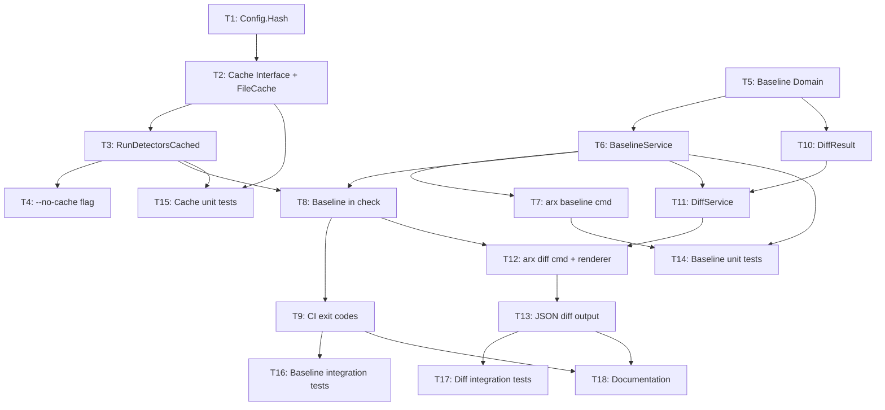

# Tasks: Arx v0.7.0 — Baseline, Diff Mode, and Performance Cache

## Review Workload Forecast

| Phase | Tasks | Est. Lines Changed | Est. New Files | Review Complexity |
|-------|-------|-------------------|----------------|-------------------|
| 1. Performance Cache | T1–T4 | ~280 | 3 | Low — additive, no interface breaks |
| 2. Baseline | T5–T9 | ~420 | 4 | Medium — exit code semantics change |
| 3. Diff Mode | T10–T13 | ~520 | 4 | High — git worktree, subprocess management |
| 4. Polish & Testing | T14–T18 | ~650 | 0 | Medium — test coverage, golden files |
| **Total** | **18** | **~1,870** | **11** | |

## Critical Path

```
T1 → T2 → T3 → T4
              ↓
T5 → T6 → T7 → T8 → T9
              ↓
T10 → T11 → T12 → T13
              ↓
T14 → T15 → T16 → T17 → T18
```

**Critical path**: T1 → T2 → T3 → T5 → T6 → T8 → T11 → T12
- Baseline filtering (T8) depends on cache wrapping (T3) because both modify `runCheck`
- Diff command (T12) depends on baseline service (T6) because diff reuses `AuditService` which will use cached detectors
- Total critical path: ~8 tasks, estimated 3–4 days of sequential work

## Parallelization Opportunities

| Parallel Group | Tasks | Rationale |
|---------------|-------|-----------|
| Group A | T1 + T5 | Both are pure domain models, no shared files |
| Group B | T7 + T4 | `arx baseline` command and `--no-cache` flag are independent once T5/T3 exist |
| Group C | T14 + T15 | Unit test suites for baseline and cache are isolated packages |
| Group D | T12 + T13 | Terminal renderer and JSON output for diff are independent output formats |
| Group E | T16 + T17 | Integration tests for baseline and diff use different test fixtures |

---

## Phase 1: Performance Cache (foundation)

### T1: Config Hash method on domain Config

**Description**: Add `Hash()` method to `domain.Config` that returns SHA-256 hex digest of the marshaled JSON config. This is the foundation for cache invalidation and baseline staleness checks. Note: `AuditService.hashConfig()` already exists as a private method hashing the *file bytes* — this new method hashes the *struct* to be deterministic regardless of YAML formatting whitespace.

**Files**:
- `internal/domain/config.go` — Edit, +12 lines (add `Hash()` method, imports `crypto/sha256`, `encoding/json`, `encoding/hex`)
- `internal/domain/config_test.go` — Edit, +25 lines (table-driven: same config → same hash, different config → different hash)

**Dependencies**: None

**Effort**: S

**Acceptance Criteria**:
- [x] `Config.Hash()` returns consistent 64-char hex string
- [x] Two identical configs (different instances) produce same hash
- [x] Any field change produces different hash
- [x] Test coverage: 100% of `Hash()` method

---

### T2: Cache port interface + FileCache implementation

**Description**: Create the `Cache` interface in `internal/ports/cache.go` and its file-based implementation in `internal/infrastructure/cache/file_cache.go`. Cache stores entries under `.arx-cache/{detector_name}/{file_hash}.json` with `CacheEntry` struct containing file hash, config hash, detector name, dependencies, and timestamp. Implements `Get()`, `Put()`, `Clear()`, and `ConfigHash()` methods. Uses atomic writes (write to temp file, rename) to prevent corruption on crash.

**Files**:
- `internal/ports/cache.go` — New, ~15 lines (Cache interface)
- `internal/infrastructure/cache/file_cache.go` — New, ~120 lines (FileCache struct, Get/Put/Clear/ConfigHash, directory management, atomic writes)
- `internal/infrastructure/cache/file_cache_test.go` — New, ~80 lines (temp dir tests for get/put/clear, config hash mismatch invalidation)

**Dependencies**: T1 (needs config hash concept)

**Effort**: M

**Acceptance Criteria**:
- [x] `Put()` writes valid JSON to `.arx-cache/{detector}/{hash}.json`
- [x] `Get()` returns cached data and `true` on hit, `nil` and `false` on miss
- [x] `Get()` returns miss when stored `config_hash` ≠ current config hash (auto-invalidation)
- [x] `Clear()` removes entire `.arx-cache/` directory
- [x] `ConfigHash()` returns the hash used for the current cache instance
- [x] Atomic writes: no partial files on crash simulation
- [x] Test coverage: 80%+

---

### T3: Wrap RunDetectors with cache check

**Description**: Create `RunDetectorsCached()` in `internal/application/cache.go` that wraps the existing `RunDetectors()` logic. Instead of modifying the `Detector` interface (design decision: application-level cache), this function iterates detectors, and for each applicable detector, walks project files, computes SHA-256 per file, checks cache before calling `ExtractImports()`. On miss, calls detector and writes cache. Aggregates all dependencies as before. The existing `RunDetectors()` remains unchanged for backward compatibility.

**Files**:
- `internal/application/cache.go` — New, ~90 lines (RunDetectorsCached function, per-file hashing, cache integration)
- `internal/application/cache_test.go` — New, ~60 lines (mock cache, verify hit skips ExtractImports, miss calls it)
- `internal/application/service.go` — Edit, +15 lines (add `cache` field to CheckService, `DetectCached()` method, update `NewCheckService` signature)

**Dependencies**: T2

**Effort**: M

**Acceptance Criteria**:
- [x] `RunDetectorsCached()` returns identical dependencies to `RunDetectors()` on cache miss
- [x] Second run on unchanged project hits cache (detector `ExtractImports` called 0 times on second run)
- [x] Config change invalidates all cache entries (different config hash → all misses)
- [x] `CheckService.DetectCached()` wires through to `RunDetectorsCached()`
- [x] Existing `CheckService.Detect()` still works unchanged (backward compat)
- [x] Test coverage: 80%+

---

### T4: --no-cache flag on check command

**Description**: Add `--no-cache` boolean flag to `arx check` command. When set, uses original `Detect()` path (no cache). When unset (default), uses `DetectCached()` path. Wire the cache service into `newCheckService()` in `root.go`. Cache directory defaults to `.arx-cache/` in project root.

**Files**:
- `cmd/arx/check.go` — Edit, +10 lines (add `checkNoCache` flag var, register flag in `init()`, conditional Detect/DetectCached in `runCheck`)
- `cmd/arx/root.go` — Edit, +12 lines (wire `FileCache` into `newCheckService`, compute config hash from loaded config)

**Dependencies**: T3

**Effort**: S

**Acceptance Criteria**:
- [x] `arx check --no-cache` runs without cache (verify by checking `.arx-cache/` is not created)
- [x] `arx check` (default) creates `.arx-cache/` with entries
- [x] `arx check --help` shows `--no-cache` flag with description
- [x] No behavioral change when cache is disabled (same violations reported)

---

## Phase 2: Baseline Suppressions (high value)

### T5: Baseline domain model

**Description**: Create `Baseline` and `BaselineViolation` structs in `internal/domain/baseline.go` with JSON tags. Implement `Fingerprint()` on `BaselineViolation` (format: `rule_id:file:line`), `IsSuppressed()` and `Filter()` on `Baseline`, and `GenerateBaseline()` constructor. Include `Version`, `ConfigHash`, `Generated`, and `Violations` fields. Fingerprint matching is O(n) — acceptable for typical baseline sizes (<10K violations).

**Files**:
- `internal/domain/baseline.go` — New, ~60 lines (Baseline, BaselineViolation structs + methods)
- `internal/domain/baseline_test.go` — New, ~60 lines (table-driven: matching fingerprints, non-matching, Filter returns only new violations)

**Dependencies**: None (pure domain, parallelizable with T1)

**Effort**: S

**Acceptance Criteria**:
- [x] `Fingerprint()` returns stable `rule_id:source_layer:target_layer:import` string (NOT file:line — file paths change during reorganization)
- [x] `IsSuppressed()` returns true when fingerprint matches any baseline entry
- [x] `Filter()` returns only violations NOT in baseline
- [x] `GenerateBaseline()` creates valid Baseline from []Violation + configHash
- [x] Baseline serializes/deserializes correctly via JSON
- [x] Test coverage: 100% of domain methods
- [x] `IsStale()` detects config hash changes
- [x] Nil baseline passthrough (no suppression when baseline is nil)

---

### T6: Baseline service (Generate, Load, IsSuppressed)

**Description**: Create `BaselineService` in `internal/application/baseline.go` with `Generate()` (runs full check, creates baseline from violations), `Load()` (reads `.arx-baseline.json`), and `IsStale()` (compares baseline config hash with current config hash). Storage is delegated to `internal/infrastructure/baseline/storage.go` for JSON file I/O. Service also exposes `DefaultPath()` returning `.arx-baseline.json`.

**Files**:
- `internal/application/baseline.go` — New, ~70 lines (BaselineService struct, Generate/Load/IsStale methods)
- `internal/infrastructure/baseline/storage.go` — New, ~45 lines (JSON read/write, file existence check)
- `internal/infrastructure/baseline/storage_test.go` — New, ~40 lines (temp dir: write then read, missing file returns nil)

**Dependencies**: T5

**Effort**: M

**Acceptance Criteria**:
- [x] `Generate()` produces baseline with all current violations
- [x] `Load()` returns nil when file doesn't exist (no error)
- [x] `Load()` returns parsed Baseline when file exists
- [x] `IsStale()` returns true when config hash differs
- [x] Storage uses atomic writes (temp file + rename)
- [x] Test coverage: 80%+
- [x] `FilterViolations()` returns only new violations (nil baseline passthrough)
- [x] Corrupted JSON handling returns error (not panic)

---

### T7: arx baseline command

**Description**: Create `baseline` cobra command in `cmd/arx/baseline.go`. Command runs full audit, generates baseline file, and prints summary (total violations baselined, file path, config hash). Supports `--force` flag to overwrite existing baseline. Supports `--config` flag for custom config path. Prints warning if baseline already exists (suggest `--force`).

**Files**:
- `cmd/arx/baseline.go` — New, ~70 lines (baseline cobra command, flags, runBaseline handler)
- `cmd/arx/root.go` — Edit, +5 lines (register baselineCmd in init)

**Dependencies**: T6

**Effort**: S

**Acceptance Criteria**:
- [x] `arx baseline` creates `.arx-baseline.json` with correct structure
- [x] `arx baseline` prints summary: "Baseline created with N violations..."
- [x] `arx baseline` warns if file exists: "Warning: baseline already exists"
- [x] `arx baseline --reset` overwrites existing file
- [x] `arx baseline` fails gracefully if no config found
- [x] Exit code 0 on success, 1 on error
- [x] `--output` flag for custom path

---

### T8: Integrate baseline filtering into arx check

**Description**: Modify `runCheck` in `cmd/arx/check.go` to load baseline (if `.arx-baseline.json` exists) and filter violations before reporting. When baseline exists: report only *new* violations to terminal, but include a summary line showing "N violations suppressed by baseline". The full violation count is still available in `--verbose` mode. Wire `BaselineService` into `newCheckService()`.

**Files**:
- `cmd/arx/check.go` — Edit, +25 lines (load baseline, filter violations, print suppression summary)
- `cmd/arx/root.go` — Edit, +8 lines (wire BaselineService into newCheckService)
- `internal/application/service.go` — Edit, +10 lines (add baselineService field to CheckService, FilterViolations method)

**Dependencies**: T6, T3 (both modify runCheck and newCheckService)

**Effort**: M

**Acceptance Criteria**:
- [x] With baseline: only new violations appear in report
- [x] With baseline: summary line shows "N violations suppressed by baseline"
- [x] Without baseline: all violations appear (existing behavior preserved)
- [x] `--verbose` mode shows suppressed count
- [x] Stale baseline (config changed) triggers warning but still filters
- [x] No regression: existing tests pass without modification
- [x] `--no-baseline` flag to ignore baseline and report all violations

---

### T9: CI mode respects baseline (exit code logic)

**Description**: Modify exit code logic in `runCheck`: when baseline exists, exit 1 only if *new* violations exist (after filtering). When no baseline, exit 1 if *any* violations exist (existing behavior). In CI mode (`--ci` / `--format json`), JSON output includes `baseline_suppressed_count` field. Add `--strict` flag to ignore baseline and fail on all violations (useful for CI gates that want zero-tolerance).

**Files**:
- `cmd/arx/check.go` — Edit, +15 lines (exit code logic with baseline awareness, --strict flag, JSON baseline field)
- `internal/infrastructure/output/json.go` — Edit, +10 lines (add BaselineSuppressedCount to JSON output struct)

**Dependencies**: T8

**Effort**: S

**Acceptance Criteria**:
- [x] With baseline + no new violations: exit 0
- [x] With baseline + new violations: exit 1
- [x] Without baseline + violations: exit 1 (existing behavior)
- [x] `arx check --ci` JSON includes `baseline_suppressed_count` when baseline exists
- [x] `arx check --no-baseline` ignores baseline, fails on all violations
- [x] Exit code logic: 1 only for NEW violations when baseline exists

---

## Phase 3: Diff Mode (complex)

### T10: DiffResult domain model

**Description**: Create `DiffResult` struct in `internal/application/diff.go` with `Added`, `Resolved`, `Unchanged` slices of `domain.Violation`, plus `RefBefore` and `RefAfter` strings. Add helper methods: `HasChanges()` (true if Added or Resolved non-empty), `AddedCount()`, `ResolvedCount()`. Comparison logic uses fingerprint matching (same as baseline).

**Files**:
- `internal/application/diff.go` — New, ~50 lines (DiffResult struct, comparison function, helper methods)
- `internal/application/diff_test.go` — New, ~50 lines (set operations: added/resolved/unchanged with mock violations)

**Dependencies**: T5 (reuses fingerprint concept)

**Effort**: S

**Acceptance Criteria**:
- [x] `CompareViolations(before, after)` correctly classifies into Added/Resolved/Unchanged
- [x] Fingerprint-based matching (rule_id:source_layer:target_layer:import)
- [x] `HasChanges()` returns false when all violations are unchanged
- [x] Empty before → all after violations are Added
- [x] Empty after → all before violations are Resolved
- [x] Test coverage: 100%

---

### T11: DiffService with git worktree isolation

**Description**: Create `DiffService` in `internal/application/diff.go` (extend from T10) with `Compare(refBefore, refAfter, projectRoot, configPath)` method. Uses `git worktree add` to create isolated checkouts at `.arx-diff/before` and `.arx-diff/after`. Runs full audit on each worktree using `AuditService`. Cleans up worktrees on completion (defer). Validates clean working tree before starting (returns error if dirty). Requires `git` binary on PATH.

**Files**:
- `internal/application/diff.go` — Edit, +100 lines (DiffService struct, Compare method, git worktree management, cleanup, dirty tree validation)
- `internal/application/diff_test.go` — Edit, +40 lines (mock git, test worktree creation/cleanup flow)

**Dependencies**: T10, T6 (reuses AuditService/BaselineService for full audit on each ref)

**Effort**: L

**Acceptance Criteria**:
- [x] `Compare()` creates worktrees at `.arx-diff/before` and `.arx-diff/after`
- [x] Runs full audit on each worktree independently
- [x] Cleans up worktrees even on error (defer cleanup)
- [x] Returns error if working tree is dirty (with helpful message)
- [x] Returns error if git not found on PATH
- [x] Returns error if refs don't exist
- [x] Worktree paths are unique per invocation (use temp subdirs to support parallel runs)
- [x] Test coverage: 70%+ (git integration is hard to mock fully)

---

### T12: arx diff command with terminal renderer

**Description**: Create `diff` cobra command in `cmd/arx/diff.go` with `<ref-before>` and `<ref-after>` args. Validates args (exactly 2 required). Calls `DiffService.Compare()`. Renders results with color-coded terminal output using lipgloss: red for Added, green for Resolved, dim for Unchanged. Shows summary counts. Exit code 1 if Added violations exist, 0 otherwise.

**Files**:
- `cmd/arx/diff.go` — New, ~80 lines (diff cobra command, arg validation, runDiff handler)
- `internal/infrastructure/output/diff_renderer.go` — New, ~90 lines (color-coded terminal renderer using lipgloss)
- `cmd/arx/root.go` — Edit, +5 lines (register diffCmd)

**Dependencies**: T11, T8 (diff command needs newCheckService pattern for service wiring)

**Effort**: M

**Acceptance Criteria**:
- [x] `arx diff HEAD~1 HEAD` runs and shows results
- [x] Added violations rendered in red
- [x] Resolved violations rendered in green
- [x] Unchanged violations rendered in dim/gray
- [x] Summary shows counts: "+N added, -N resolved, N unchanged"
- [x] Exit 1 if any Added violations, exit 0 otherwise
- [x] `arx diff` with wrong args shows usage
- [x] No worktree left behind after command completes

---

### T13: JSON output for diff

**Description**: Add `--format json` flag to `arx diff` command. JSON output includes full DiffResult structure with all violation details. Useful for CI integration and programmatic consumption. JSON schema: `{ "ref_before": "...", "ref_after": "...", "added": [...], "resolved": [...], "unchanged": [...] }`.

**Files**:
- `cmd/arx/diff.go` — Edit, +15 lines (add --format flag, conditional JSON rendering)
- `internal/infrastructure/output/diff_renderer.go` — Edit, +25 lines (JSON renderer for DiffResult)

**Dependencies**: T12

**Effort**: S

**Acceptance Criteria**:
- [x] `arx diff HEAD~1 HEAD --format json` outputs valid JSON
- [x] JSON includes all three violation categories with full details
- [x] JSON includes ref_before and ref_after fields
- [x] JSON output is machine-parseable (no ANSI codes)
- [x] Exit code behavior same as terminal mode

---

## Phase 4: Polish & Testing

### T14: Unit tests for baseline (filter, config hash, invalidation)

**Description**: Comprehensive unit tests for baseline domain and service. Table-driven tests for `IsSuppressed()` (matching, non-matching, edge cases), `Filter()` (empty baseline, empty violations, partial match), config hash staleness detection, and baseline JSON round-trip serialization.

**Files**:
- `internal/domain/baseline_test.go` — Edit, +40 lines (additional edge cases)
- `internal/application/baseline_test.go` — New, ~60 lines (service-level: generate, load, stale detection with mock storage)
- `internal/infrastructure/baseline/storage_test.go` — Edit, +20 lines (corrupted JSON handling, large baseline performance)

**Dependencies**: T6, T7

**Effort**: M

**Acceptance Criteria**:
- [ ] 15+ test cases for baseline domain methods
- [ ] Config hash staleness: baseline with old hash → IsStale() = true
- [ ] Corrupted JSON file → Load() returns error (not panic)
- [ ] Empty baseline file → Load() returns nil or empty baseline
- [ ] Test coverage: 90%+ for baseline packages

---

### T15: Unit tests for cache (hit, miss, invalidation)

**Description**: Comprehensive unit tests for FileCache. Tests: cache miss on first run, cache hit on second run, config hash invalidation, per-detector isolation, Clear() removes all entries, atomic write verification (temp file cleanup), concurrent read safety.

**Files**:
- `internal/infrastructure/cache/file_cache_test.go` — Edit, +50 lines (concurrent access, atomic write verification, edge cases)
- `internal/application/cache_test.go` — Edit, +40 lines (integration with mock detectors, verify ExtractImports call count)

**Dependencies**: T3

**Effort**: M

**Acceptance Criteria**:
- [ ] Cache miss → ExtractImports called, entry written
- [ ] Cache hit → ExtractImports NOT called, cached data returned
- [ ] Config change → all entries treated as misses
- [ ] Different detectors have isolated cache namespaces
- [ ] Clear() removes entire cache directory
- [ ] Concurrent reads don't corrupt cache files
- [ ] Test coverage: 85%+ for cache packages

---

### T16: Integration tests for baseline + check

**Description**: Integration tests using real test fixtures. Golden file test: run `arx baseline` on known project, verify `.arx-baseline.json` content. Then add a new violation to the project, run `arx check`, verify only new violation reported. Remove the new violation, run `arx check`, verify exit 0.

**Files**:
- `test/integration/baseline_test.go` — New, ~100 lines (golden file baseline test, check with baseline, exit code verification)
- `test/fixtures/baseline-project/` — New fixture directory (simple project with known violations)

**Dependencies**: T9

**Effort**: M

**Acceptance Criteria**:
- [ ] Golden file test: baseline JSON matches expected structure
- [ ] `arx check` with baseline: only new violations reported
- [ ] Exit code 0 when no new violations (with baseline)
- [ ] Exit code 1 when new violations exist (with baseline)
- [ ] `--strict` flag overrides baseline, all violations reported
- [ ] Tests run in CI (no git required)

---

### T17: Integration tests for diff mode

**Description**: E2E test for `arx diff`. Create a git repo fixture with two commits: commit A has 3 violations, commit B has 5 violations (2 new, 1 resolved). Run `arx diff A B`, verify 2 added, 1 resolved, 2 unchanged. Test dirty tree rejection. Test invalid ref handling.

**Files**:
- `test/integration/diff_test.go` — New, ~120 lines (git repo setup, diff between commits, dirty tree test, invalid ref test)
- `test/fixtures/diff-project/` — New fixture (git repo with controlled violation changes between commits)

**Dependencies**: T13

**Effort**: L

**Acceptance Criteria**:
- [ ] `arx diff` between commits shows correct added/resolved/unchanged counts
- [ ] Dirty working tree → error with helpful message
- [ ] Invalid ref → error with helpful message
- [ ] Git not on PATH → graceful error
- [ ] Worktrees cleaned up after test (no leftover `.arx-worktree/`)
- [ ] JSON output mode produces parseable JSON
- [ ] Tests require git binary (skip if not available)

---

### T18: Documentation (README update, baseline guide)

**Description**: Update README.md with new features: cache configuration section, baseline workflow guide, diff mode usage examples. Add `docs/baseline.md` with detailed guide on baseline workflow for teams adopting arx. Update `docs/cache.md` with cache configuration options and troubleshooting.

**Files**:
- `README.md` — Edit, +60 lines (cache section, baseline section, diff section, updated examples)
- `docs/baseline.md` — New, ~80 lines (baseline workflow guide, CI integration, team conventions)
- `docs/cache.md` — New, ~40 lines (cache config options, invalidation behavior, troubleshooting)

**Dependencies**: T9, T13 (all features must be implemented before documenting)

**Effort**: M

**Acceptance Criteria**:
- [ ] README includes `cache:` config section example
- [ ] README includes `arx baseline` workflow example
- [ ] README includes `arx diff` usage examples
- [ ] docs/baseline.md covers: generating baseline, CI integration, stale baseline handling
- [ ] docs/cache.md covers: enabling cache, TTL config, max size, troubleshooting
- [ ] All examples use correct flag names and output formats
- [ ] No references to out-of-scope features (auto-baseline, distributed cache, etc.)

---

## Task Dependency Graph (Mermaid)



## Execution Recommendations

1. **Start with T1 + T5 in parallel** — both are pure domain models with zero dependencies. Quick wins that unblock everything else.

2. **T2 before T3** — cache infrastructure must exist before wrapping RunDetectors. Don't skip the port interface; it enables mocking in tests.

3. **T8 is the riskiest task** — it modifies `runCheck` which is the most-used code path. Write the filtering logic first, then integrate. Keep the change minimal: load baseline → filter → report.

4. **T11 needs careful error handling** — git worktree operations can fail in many ways (dirty tree, missing refs, no git binary, permission errors). Each failure mode needs a clear error message. Use `defer` for cleanup.

5. **Test fixtures are critical** — T16 and T17 depend on well-crafted test fixtures. Create `test/fixtures/baseline-project/` and `test/fixtures/diff-project/` early (during T14/T15) so integration tests can start immediately.

6. **Don't skip T4** — the `--no-cache` escape hatch is essential for debugging. Without it, cache bugs are extremely hard to diagnose.

7. **JSON output (T13) is cheap** — once terminal renderer exists, JSON is just struct marshaling. Do it immediately after T12 while the DiffResult model is fresh.

8. **Documentation last (T18)** — but write doc outlines during T7/T12 to catch UX issues early. If a feature is hard to document, it might be hard to use.
